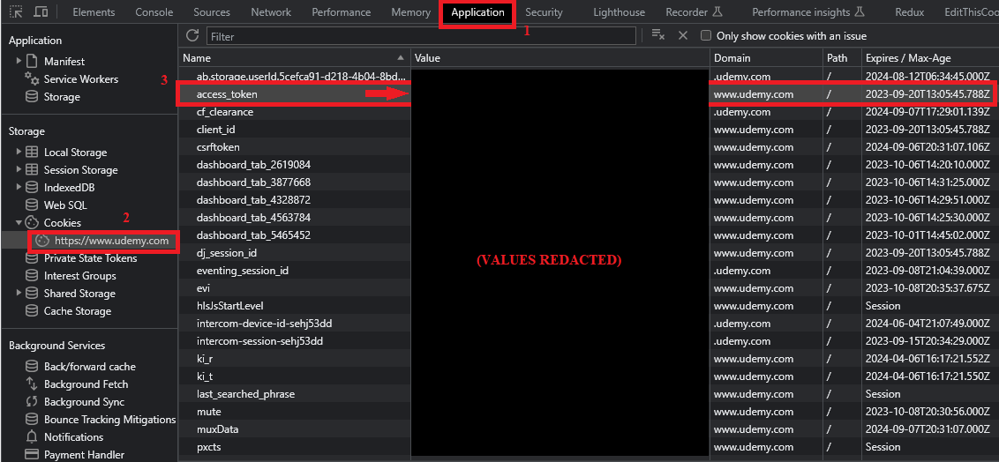
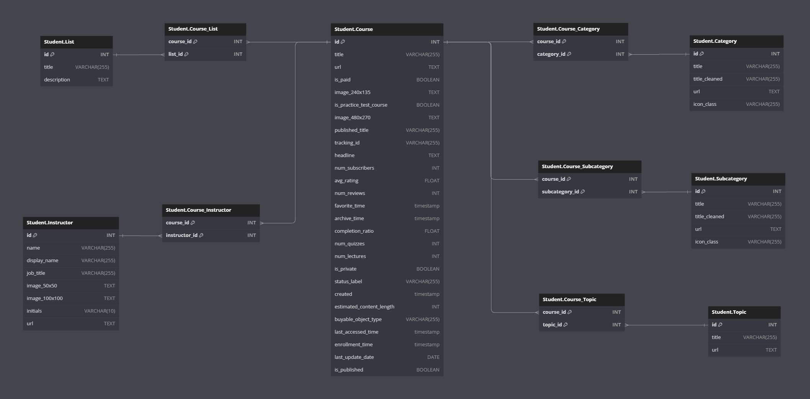

# Downloading Metadata for Udemy Student Account Courses Lists

## Overview

A semi-automated, scripts-based approach for downloading courses metadata for an authenticated [Udemy](https://www.udemy.com) user account. Based on Udemy v.2.0 API. Corresponding data is based on HTTP requests inferred from user-authenticated view `https://www.udemy.com/home/my-courses/lists/`.

### Use Policy

***Caution***: Use of this script and corresponding compliance with [Udemy's terms and related policies](https://www.udemy.com/terms/) are the **sole responsibility** of the user and corresponding Udemy account holder. This script is provided for ***personal use only***, and is primarily intended for data organization and/or for related pedagogical purposes (e.g., courses scheduling/planning). The author neither endorses nor encourages the use of these scripts for "abusive," counter-to-terms, or related purposes, and correspondingly claims **no** responsibility for any such misuses. ***Download responsibly***.

## Prereqs

Intended for running/use on Unix-based systems (drafted on Ubuntu 22.04), or equivalent (e.g., [Git Bash](https://gitforwindows.org/), [WSL](https://aka.ms/wsl), etc. on Windows). Additional external dependencies are as follows:
  * [`jq`](https://jqlang.github.io/jq/) command-line utility for JSON parsing
  * (***optional***) Node.js v.16+
  * (***optional***) Postgres v.13+

***N.B.*** ***optional*** dependencies only required for JSON to SQL conversion. See corresponding steps `2` and `3` in the next section.

## Steps for Use

***N.B.*** All terminal commands in this section assume a reference location of the top-level repo directory (i.e., `.../udemy-my-courses-data-parser/`).

### 1. Authentication

To download the JSON payload containing the lists and courses data, first you must authenticate into your Udemy user account. To do this most simply, use the [Udemy website](https://www.udemy.com) itself and log in there.

Once authenticated, retrieve your `access_token` via browser developer tools or equivalent. Using Google Chrome Developer Tools as a representative example, this can be accomplished as follows:

<center>

</center>

***N.B.*** The `access_token` value is an alphanumeric string, approximately 40 total alphanumeric characters in length. Furthermore, note that this value is **sensitive** and should **NOT** be shared accordingly, as it provides **direct access** to your Udemy account!

### 2. Downloading Data as JSON

To download all lists and their constituent courses as a flattened JSON array (i.e., of general form `[ { list1 }, { list2 }, ...]`), run the corresponding parsing script from the command line as follows:

```bash
./udemy-list-parser.sh
```

At the terminal prompt `Enter your Udemy account access token: `, provide the `access_token` value from the previous step and then press `ENTER` to run the script.

***N.B.*** The script has dynamically set parameters, which can be adjusted accordingly to your preference. These are set here to run with relatively "slow delay" (ca. 8 ± 0.25 seconds, downloading/proceeding at a rate of page size `1` and page count `1`, where a page here corresponds to a single list) to ensure full data download and no corresponding prematurely canceled requests. Correspondingly, this may take a few minutes to run.

On successful completion of the script, the following message will appear in the terminal:

```bash
Combined JSON data saved to udemy_lists_<timestamp>.json
```

where `<timestamp>` is the corresponding [Unix timestamp](https://www.unixtimestamp.com/) taken on initial run of the script.

This resulting payload has the following **general form**:

```json
[
  // list 1
  {
    "id": <number>,
    "title": <string>,
    "description": <string>,
    "list_id": <number>,
    "courses": [
      // list 1, course 1
      {
        "_class": "course",
        "id": <number>,
        "title": <string>,
        "url": <string>,
        "is_paid": <boolean>,
        "visible_instructor": [
          // list 1, course 1, instructor 1
          {
            "_class": "user",
            "id": <number>,
            "title": <string>,
            "name": <string>,
            "display_name": <string>,
            "job_title": <string>,
            "image_50x50": <string>,
            "image_100x100": <string>,
            "initials": <string>,
            "url": <string>
          },
          ... // list 1, course 1, instructors 2...N
        ],
        "image_240x135": <string>,
        "is_practice_test_course": <boolean>,
        "image_480x270": <string>,
        "published_title": <string>,
        "tracking_id": <string>,
        "headline":  <string>,
        "num_subscribers": <number>,
        "avg_rating": <number>,
        "num_reviews": <number>,
        "favorite_time": <string | null>,
        "archive_time": <string | null>,
        "completion_ratio": <number>,
        "num_quizzes": <number>,
        "num_lectures": <number>,
        "is_private": <boolean>,
        "status_label": <string>,
        "features": {
          "_class": "course",
          "discussions_create": <boolean>,
          "discussions_view": <boolean>,
          "discussions_replies_create": <boolean>,
          "enroll": <boolean>,
          "reviews_create": <boolean>,
          "reviews_view": <boolean>,
          "reviews_responses_create": <boolean>,
          "announcements_comments_view": <boolean>,
          "educational_announcements_create": <boolean>,
          "promotional_announcements_create": <boolean>,
          "promotions_create": <boolean>,
          "promotions_view": <boolean>,
          "students_view": <boolean>
        },
        "is_published": <boolean>,
        "primary_category": {
          "id": <number>,
          "title": <string>,
          "title_cleaned": <string>,
          "url": <string>,
          "icon_class": <string>,
          "type": "category",
          "channel_id": null,
          "_class": "course_category"
        },
        "primary_subcategory": {
          "id": <number>,
          "title": <string>,
          "title_cleaned": <string>,
          "url": <string>,
          "icon_class": <string>,
          "type": "subcategory",
          "channel_id": null,
          "_class": "course_subcategory"
        },
        "created": <string>,
        "estimated_content_length": <number>,
        "buyable_object_type": "course",
        "last_accessed_time": <string>,
        "enrollment_time": <string>,
        "last_update_date": <string>,
        "context_info": {
          "category": {
            "id": <number>,
            "title": <string>,
            "url": <string>,
            "tracking_object_type": "cat"
          },
          "subcategory": null,
          "label": {
            "id": <number>,
            "display_name": <string>,
            "title": <string>,
            "topic_channel_url": <string>,
            "url": <string>,
            "tracking_object_type": "cl"
          }
        }
      },
      ... // list 1, courses 2...N
    ],
  },
  ... // lists 2...N
]
```

### 3. (***Optional***) Transform JSON Payload to SQL Tables

If desired, the resulting JSON payload from the previous step can be transformed to SQL tables for additional querying, transformation, etc.

To do this, connect to a live Postgres server instance, create a new database (or simply use default database `postgres` or equivalent if not specified otherwise), and then create tables using the script provided in `create_tables.sql`. This will define tables as follows (under schema `student`):

| Schema-Qualified Table Name | Entity or Join Table Type|
|:--:|:--:|
| `student.course` | entity |
| `student.list` | entity |
| `student.instructor` | entity |
| `student.category` | entity |
| `student.subcategory` | entity |
| `student.topic` | entity |
| `student.course_list` | join |
| `student.course_instructor` | join |
| `student.course_category` | join |
| `student.course_subcategory` | join | 
| `student.course_topic` | join |

***N.B.*** In general, there is a many-to-many relationship between `course` and the other entities, which in turn is captured via the respective `course_<...>` join tables accordingly.

The corresponding [ER diagram](https://dbdiagram.io/d/64fbb50802bd1c4a5e3d738e) is as follows:

<center>

</center>

With the tables created, to create the seed data to populate the tables from the downloaded JSON payload in the previous step, run the generator script `create-seed.js` via Node.js from the command line as follows:

```bash
node create-seed.js udemy_lists_<timestamp>.json
```
 where `udemy_lists_<timestamp>.json` is the JSON payload file generated in the previous step.

On successful completion of the script, the following message will appear in the terminal:

```bash
Entity SQL insert statements have been generated and saved to seed_data_<timestamp>.sql
Join SQL insert statements have been generated and saved to seed_data_<timestamp>.sql
```

where `<timestamp>` is the corresponding [Unix timestamp](https://www.unixtimestamp.com/) taken on initial run of the script.

Furthermore, as this message suggests, this creates a new file `seed_data_<timestamp>.sql` which provides the corresponding `INSERT ...` statements to populate the tables.

With the tables populated, this provides a useful "bird's eye" view of your courses (i.e., relative to more-tedious browser-/UI-based navigation to discern the same data), along with enhanced querying capabilities, e.g.,:

```sql
SET search_path TO student; -- use schema `student`

SELECT 
  ARRAY_AGG(DISTINCT list.title ORDER BY list.title) AS "lists",
  course.title AS "course",
  ARRAY_AGG(DISTINCT instructor.display_name ORDER BY instructor.display_name) AS "instructors",
  ROUND(course.estimated_content_length / 60.0, 2) AS "length (hrs)",
  category.title AS "category",
  subcategory.title AS "subcategory",
  topic.title AS "topic"
FROM course
LEFT JOIN course_list ON course_list.course_id = course.id
LEFT JOIN course_category ON course_category.course_id = course.id
LEFT JOIN course_subcategory ON course_subcategory.course_id = course.id
LEFT JOIN course_topic ON course_topic.course_id = course.id
LEFT JOIN list ON course_list.list_id = list.id
LEFT JOIN category ON course_category.category_id = category.id
LEFT JOIN subcategory ON course_subcategory.subcategory_id = subcategory.id
LEFT JOIN topic ON course_topic.topic_id = topic.id
LEFT JOIN course_instructor ON course_instructor.course_id = course.id
LEFT JOIN instructor ON course_instructor.instructor_id = instructor.id
GROUP BY course.title, course.estimated_content_length, topic.title, category.title, subcategory.title
ORDER BY "lists", "category", "instructors", "subcategory", course.title
;
```

### 4. Updating the Data

To repeat this process (i.e., to update the existing data with new/live data from Udemy), re-run the script in step `2` for regenerating the JSON payload. Furthermore, to reseed the database data, run the script in `truncate_tables.sql`, and then repeat step `3`. 
